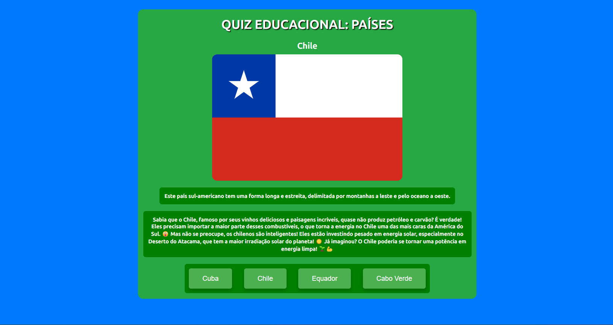
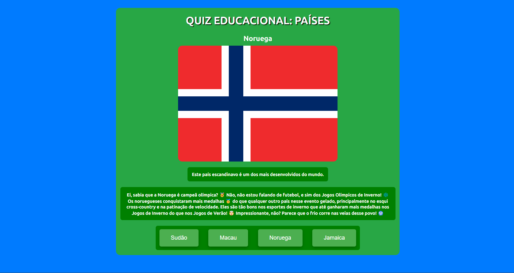

# Projeto Alura - Imersão IA + Google

  
  
  

O desafio final da Imersão tem por objetivo desenvolver algo que seja útil, criativo e eficaz. Por meio desse documento apresento a minha proposta de resolução do desafio, envolvendo a utilização da API do Google, web scraping para gerar respostas relacionadas e limitadas ao conteúdo em questão.

  <a href="#autor">Autor</a>&nbsp;&nbsp;&nbsp;|&nbsp;&nbsp;&nbsp;
  <a href="#objetivo">Objetivo</a>&nbsp;&nbsp;&nbsp;|&nbsp;&nbsp;&nbsp;
  <a href="#sobre">Sobre</a>&nbsp;&nbsp;&nbsp;|&nbsp;&nbsp;&nbsp;
  <a href="#tecnologias">Tecnologias</a>&nbsp;&nbsp;&nbsp;|&nbsp;&nbsp;&nbsp;
  <a href="#referencias">Referências</a>&nbsp;&nbsp;&nbsp;|&nbsp;&nbsp;&nbsp
  <a href="#exemplos">Exemplos</a>

## Autor

Meu nome é Héber Stavrakas Gaipo, sou estudante de Engenharia da Computação e estou participando da Imersão Alura + Google, 2ª edição - 2024.

  
  
  
  
  
  

## Objetivo

O objetivo desse projeto é, utilizando a IA Generativa do Google, gerar um quiz com fins educativos sobre países, trazendo dicas e curiosidades geradas artificialmente com base em web scraping.

Através desse método pode-se gerar rotas com quizes sobre diversos assuntos, principalmente de fins escolares.

## Sobre

Quando a página inicia é sortido um índice dentro do arquivo `countries.json` e seleciona o nome do país de acordo com esse índice e armazena em `country_name`.

- `` const random_index = Math.floor(Math.random() * countries.length);
country_name = `${countries[random_index].nome}`; ``

É solicitado para a API do Gemini que gere uma dica, da seguinte forma: `` const result = await chat.sendMessage(
      `Escreva uma dica em uma frase sobre "${country_name}", mas que não contenha a palavra "${country_name}". Extraia essa informação do texto "${page_content}", sem incluir informações que não estejam presentes nele.`
    );  ``.

A imagem gerada no frontend recebe o src como `https://static.significados.com.br/flags/` incluindo o sufixo relacionado com a `sigla2` presente no mesmo índice do `country_name` em `countries.json` e é armazenada em `countrySG`:

- `` const imgURL = `https://static.significados.com.br/flags/${countrySG.toLowerCase()}.svg`; ``
- Esse link segue o mesmo padrão para todas as siglas dos países em letras minúsculas (`.toLowerCase()`)

Com o `country_name` é feito um tratamento da variável para que se inclua no endereço da Wikipédia, que segue um padrão, sendo `https://pt.wikipedia.org/wiki/ + Nome_Do_País`.

Relacionado ao web scraping, o conteúdo da página Wikipédia é armazenado na variável `page_content` e a curiosidade gerada na tela depois de submetida a resposta do quiz é gerada pelo comando `` const result = await chat.sendMessage(`Escreva uma breve curiosidade sobre "${page_content}" apenas utilizando o conteúdo do texto. Adote um linguajar interessante e carismático.`); ``

- Web scraping
  - Trata-se de um método digital que extrai dados de sites específicos para transformá-los em informações úteis.
  - Agora, vamos ver alguns dos usos mais legais do web scraping:
    - Análise de mercado: monitorar preços e tendências para tomar decisões estratégicas no seu negócio.
    - Pesquisa de dados: coletar informações para pesquisas acadêmicas ou projetos pessoais.
    - Automação de tarefas: automatizar tarefas repetitivas, como atualizar planilhas com dados de sites.

O `result` também recebe tratamento para remover os caracteres especiais de Markdown que recebe no output.

Com esse método, por mais que um país seja sorteado mais de uma vez, a dica e a curiosidade será sempre uma novidade!

Os 4 botões do quiz são 1 para a resposta correta e os outros 3 possuem valores sorteados aleatoriamente de índices no `countries.json` e a posição dos botões também é gerada aleatoriamente.

---

Arquivos mencionados na seção:

  
  

---

## Tecnologias

  
  
  
  
  
  
  
  

## Referencias

  
  
  
  

## Exemplos

  
  
  
  
  
  

